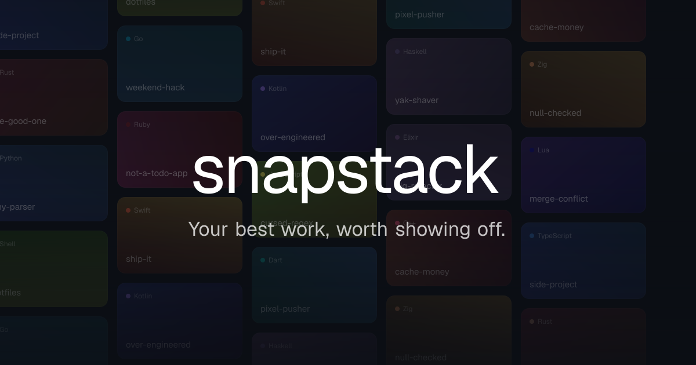
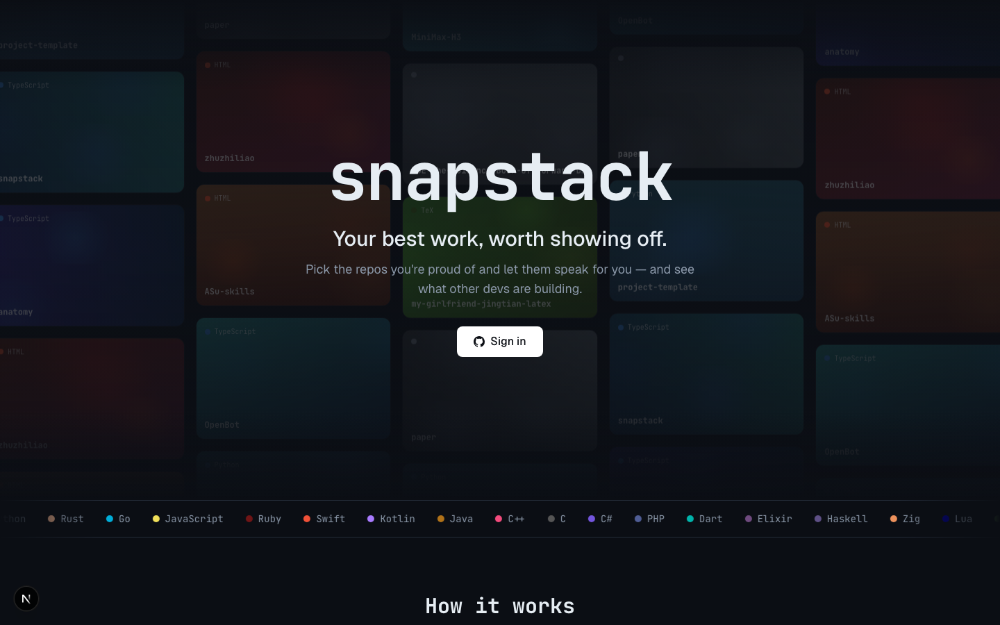
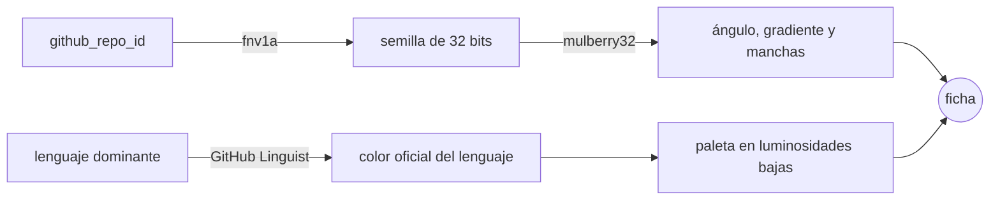
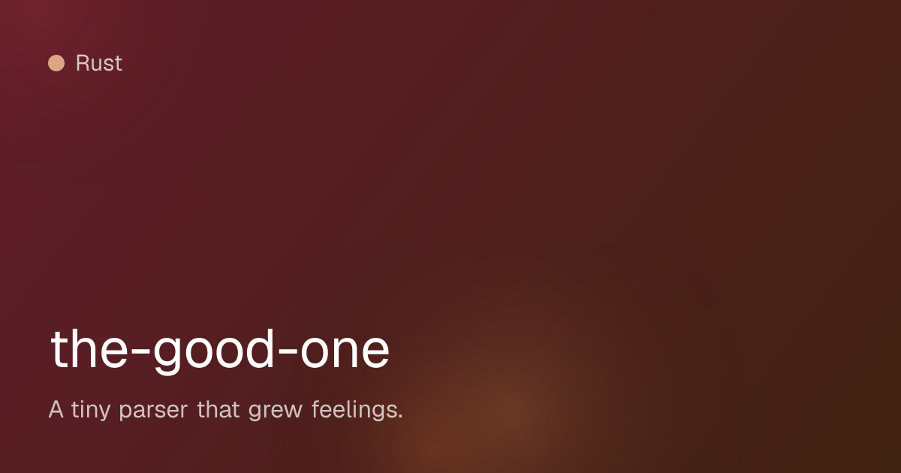
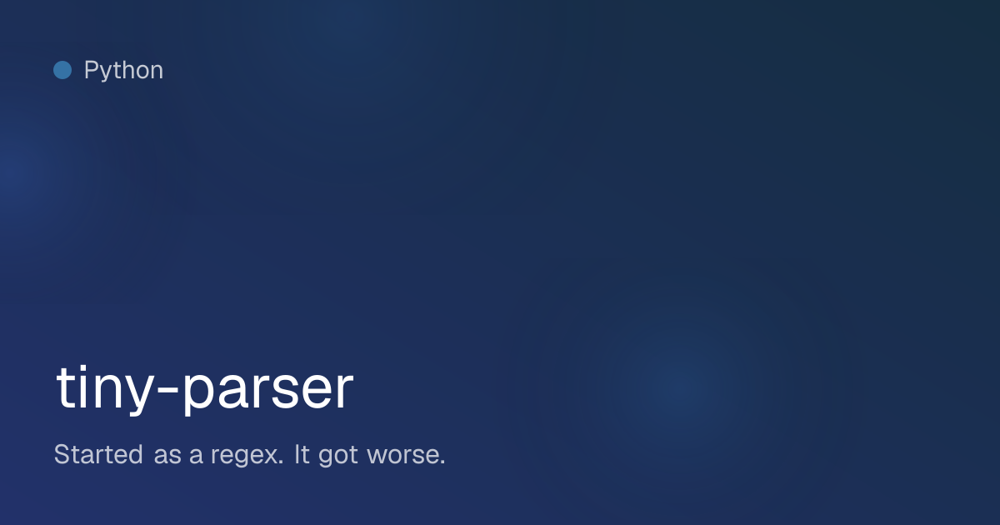
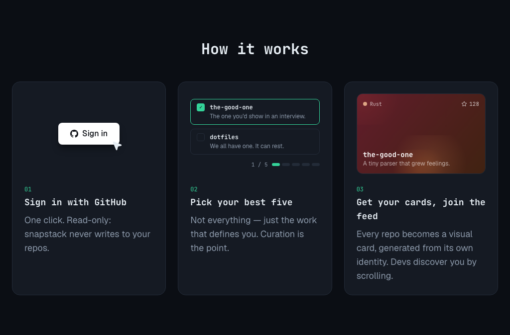
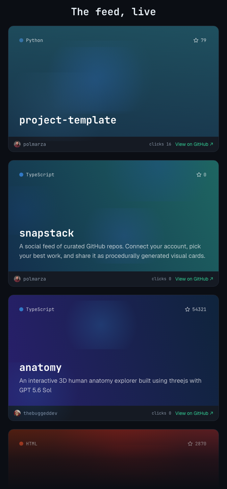

<p align="center">
  
</p>

<p align="center">
  <a href="https://snapstack.sh"></a>
  <a href="./LICENSE"></a>
  
</p>

<p align="center">
  <a href="https://snapstack.sh"><strong>snapstack.sh →</strong></a>
</p>

---

## ¿Qué es snapstack?

Una red social para desarrolladores construida sobre GitHub. Conectas tu cuenta, eliges **a
mano** hasta 5 repos — los que definen lo que construyes, no un volcado de toda tu cuenta — y
cada uno se convierte en una **ficha visual generada proceduralmente**. El conjunto se navega
en un feed de scroll infinito: sin swipe, sin likes. La intención es social y pasiva: seguir a
un dev y ver qué construye.

<p align="center">
  
</p>

## Las fichas: mismo repo, misma ficha, siempre

Cada ficha se genera a partir de la **identidad del propio repo** — nada de capturas, nada de
IA, nada de aleatoriedad entre recargas:



El hash del ID del repo (estable ante renombrados) alimenta un generador determinista, y la
paleta se ancla al **color oficial de GitHub Linguist** del lenguaje dominante: las tarjetas
del mismo stack comparten familia cromática. El render es JSX → imagen con `@vercel/og`
(Satori), cacheable por CDN — y la misma data pinta la tarjeta del feed en HTML/CSS, legible a
cualquier ancho.

| Rust | TypeScript | Python |
|:---:|:---:|:---:|
|  |  |  |

## Cómo funciona

<p align="center">
  
</p>

1. **Entra con GitHub.** Un click, y en solo lectura: snapstack nunca escribe en tus repos.
2. **Elige tus mejores cinco.** El límite es el producto: una selección curada dice más que
   ochenta repos de relleno. Si Linguist no detecta lenguaje (una skill en Markdown, por
   ejemplo), puedes fijarlo a mano.
3. **Tus fichas entran al feed.** Los devs te descubren haciendo scroll, te siguen, y tus
   tarjetas muestran los clicks que reciben.

<p align="center">
  
</p>

## Qué hay dentro (v1, en producción)

- **Login con GitHub** (Clerk) y perfil público en `snapstack.sh/u/<usuario>`, indexable y con
  su propia portada al compartir.
- **Selección curada** con límite de 5, gestionable en cualquier momento; los repos de otros
  no se pueden reclamar (verificación de propiedad en servidor).
- **Feed cronológico** con paginación por cursor estable, filtro *Following* y contador de
  clicks real por ficha.
- **Follows nativos** — deliberadamente no espejan el follow de GitHub.
- **Sincronización por webhooks**: un repo borrado o vuelto privado en GitHub desaparece del
  feed sin contenido fantasma; las stars se actualizan solas.
- **Semilla de contenido**: repos trending importados para que el feed nunca nazca vacío.
- **Señales implícitas instrumentadas** (permanencia, clicks, follows) — solo registro; ningún
  ranking las consume en v1, por decisión de producto.
- **Moderación ligera**: filtro básico de contenido en la puerta y reporte por usuarios.
- **Borrado de cuenta real**, no desactivación.

## Stack

| Capa | Tecnología |
|------|-----------|
| Framework + hosting | Next.js (App Router) + Vercel |
| Base de datos | Supabase Postgres + pgvector |
| Autenticación | Clerk (provider de GitHub) |
| Sincronización GitHub | Webhooks con firma HMAC (GitHub App en producción) |
| Fichas visuales | `@vercel/og` (Satori) + motor procedural propio |
| Estilos | Tailwind CSS |
| Analítica | Vercel Web Analytics (sin cookies, sin banner) |

Justificaciones y decisiones técnicas en [`docs/architecture.md`](docs/architecture.md).

## Desarrollo local

Requisitos: Node 20.6+, pnpm v11 (`corepack enable`), Docker (para Supabase local).

```bash
pnpm install
supabase start          # stack local en puertos 573xx
pnpm seed:trending      # siembra el feed con repos trending reales
pnpm dev
```

Copia `.env.example` como `.env.local` y rellena los valores (el bloque local de Supabase sale
de `supabase start`). Tests — siempre contra localhost, nunca contra servicios reales:

```bash
pnpm test        # unitarios (Vitest)
pnpm test:e2e    # end-to-end (Playwright)
```

## Estructura

```
docs/            → Documentación viva del proyecto (leer antes de trabajar)
docs/features/   → Una ficha por unidad de trabajo, con su tabla de cobertura
changelog/       → Registro estructurado de cada cambio importante
mejoras/         → Backlog de ideas fuera del sprint actual
scripts/         → verificar-cobertura.mjs (corre en CI) y utilidades
src/             → Código de la app (estructura detallada en docs/architecture.md)
supabase/        → Config del stack local y migraciones
```

## Cómo contribuir

El proyecto sigue el protocolo de [`CLAUDE.md`](CLAUDE.md): toda sesión empieza leyendo
`docs/`, cada feature se acuerda en una ficha antes de construirse, cada cambio deja entrada
en `changelog/`, y los PRs llevan la salida real de los comandos como evidencia — no casillas
marcadas.

## Licencia

MIT © 2026 [Pol Marzà](https://github.com/polmarza). Ver [`LICENSE`](./LICENSE).

<p align="center">
  Made with ❤️ by <a href="https://www.linkedin.com/in/polmarza/">Pol Marzà</a> in Barcelona
</p>
