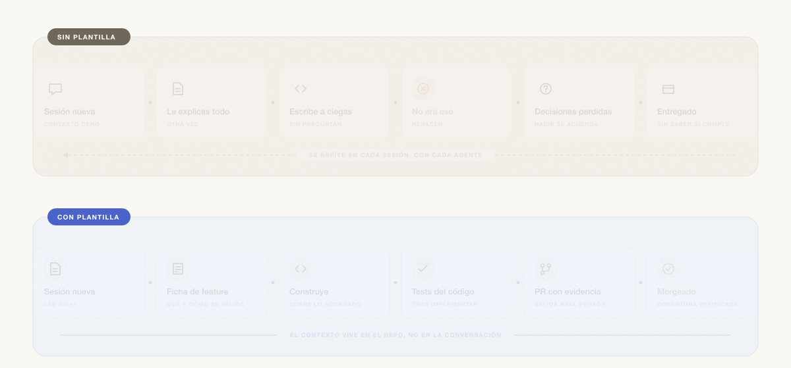
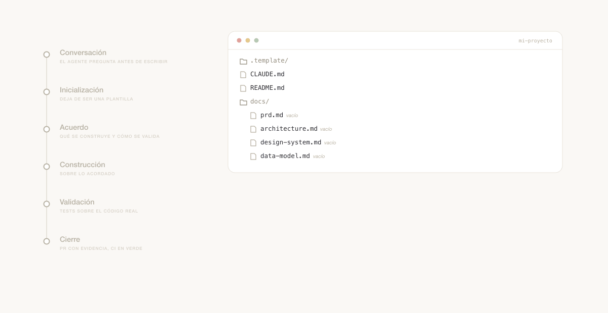
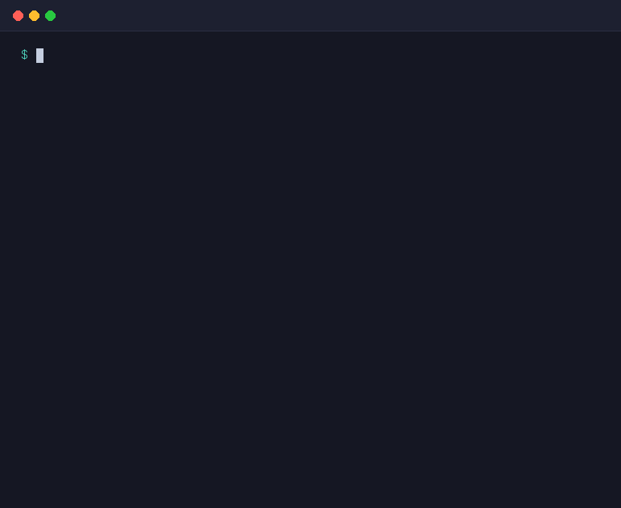

<h1 align="center">project-template</h1>

  Plantilla para empezar proyectos cuando trabajas con agentes de código 
  sin que se pongan a escribir antes de entender qué estás construyendo.

  
  
  
  

  <a href="https://github.com/polmarza/project-template/generate"><strong>Usar esta plantilla →</strong></a>

  

---

## ¿Qué es esto?

Una plantilla de repositorio que impone un protocolo simple: **antes de tocar código, el agente lee la documentación del proyecto**.

Si los documentos están vacíos, empieza haciendo preguntas — no escribiendo código. Si están rellenos, arranca con todo el contexto cargado y sin tener que volver a explicárselo en cada sesión.

Es agnóstica al stack. El protocolo funciona igual con Next.js, Astro, FastAPI o cualquier otra cosa que decidas usar.

---

## ¿Para quién es?

- Founders y equipos pequeños que construyen productos con ayuda de agentes de IA y quieren reducir el rework.
- Cualquiera que se haya cansado de explicarle al modelo el mismo contexto en cada conversación nueva.

---

## ¿Qué hay dentro?

- **`CLAUDE.md`** — Contrato de entrada para el agente. Define qué leer, cómo se trabaja una feature, cómo registrar cambios, cómo configurar los MCPs del stack, qué no hacer y dónde están los límites de lo que puede ejecutar por su cuenta.
- **`docs/`** — Ocho archivos vivos que capturan las decisiones que típicamente se pierden entre conversaciones: producto, arquitectura, modelo de datos, design system, business, roadmap, flujos de usuario y testing. **No todos aplican a todos los proyectos**: hay una tabla que decide cuáles según el tamaño.
- **`docs/features/`** — Una ficha por unidad de trabajo acordada: qué se construye, qué requisitos cierra y **cómo se va a comprobar cada uno**. Es el contrato que se firma antes de escribir código. **Llega vacía**.
- **`changelog/`** — Registro estructurado de cada cambio importante: qué, cuándo, por qué y qué requisitos cierra. **Llega vacío**: solo con el archivo que explica el formato.
- **`mejoras/`** — Backlog de ideas que no entran en el sprint actual pero no se quieren perder.
- **`.claude/`** — Configuración de Claude Code con permisos sensatos y slash commands custom, para no tener que recordar el protocolo de memoria.
- **`scripts/`** — Una verificación ejecutable: comprueba que ninguna ficha deje un requisito sin validar y que los tests prometidos existan de verdad. Node sin dependencias.
- **`.github/`** — Plantillas de pull request e issues alineadas con el protocolo, y el workflow que ejecuta esa verificación en cada PR. El PR pide **evidencia pegada**, no casillas marcadas.
- **`.template/`** — Historial de la plantilla en sí. Se borra al inicializar tu proyecto, así no arrastras cambios que no son tuyos.
- Lo aburrido pero necesario: `.gitignore`, `.env.example`, `LICENSE`.

---

## ¿Cómo funciona el protocolo?

  

1. **Cualquier sesión empieza leyendo `docs/`.** Si están vacíos o incompletos, el agente pregunta antes de actuar. Y no pide los ocho documentos: pide los que correspondan al tamaño del proyecto.
2. **Cada funcionalidad del PRD lleva ID y criterio de aceptación comprobable.** "Dado…, cuando…, entonces…", con un resultado que se pueda mirar. Ese criterio es el que después se convierte en test.
3. **Antes de construir una feature se escribe su ficha** en `docs/features/`, con una tabla que dice cómo se validará cada requisito. Ningún requisito se queda sin tercera columna: o lleva la ruta de su test, o lleva la razón concreta por la que no se puede testear así. **Y esto no es honor system**: un script lo verifica en cada PR, y falla si un test prometido no existe.
4. **Los tests se escriben después de implementar**, leyendo el código real. Escritos antes apuntan a selectores imaginados, y acaban vaciándose de aserciones hasta que pasan.
5. **Cada cambio importante deja registro en `changelog/`** con qué se hizo, qué se modificó, por qué y qué requisitos cierra.
6. **Si el cambio afecta a algo documentado, se actualiza el doc en la misma sesión.** No hay documentación desincronizada.
7. **Con el stack ya decidido, el agente pregunta qué MCPs quieres** y con qué alcance: los globales que ya tengas, o servidores configurados a nivel de proyecto en `.mcp.json`. No instala nada por su cuenta ni antes de que haya stack.
8. **El PR se cierra con evidencia, no con casillas.** La salida real de los comandos va pegada en el PR; lo que no se ha ejecutado se dice.
9. **Antes de mergear a producción**, se ejecuta `/security-review` para detectar vulnerabilidades, credenciales filtradas y problemas comunes.
10. **Las ideas que no entran ahora se anotan en `mejoras/`** sin interrumpir el flujo actual.

### La regla que lo sostiene

Ningún requisito se queda sin su tercera columna: **o lleva la ruta del test que lo valida, o lleva
la razón concreta por la que no se puede validar así.** Y no es una norma de buena voluntad — hay
un script que la comprueba, y corre en CI con cada pull request.

La gracia está en cuándo aprieta y cuándo no. Mientras la ficha está en construcción no exige nada:
los tests se escriben después de implementar. En el momento en que la das por **Verificada**, el
test prometido tiene que existir.

  

---

## Comandos

| Comando | Qué hace |
|---------|----------|
| `/feature` | Crea la ficha de una feature **antes** de construirla, con su tabla de cobertura |
| `/changelog` | Registra un cambio con el formato del proyecto |
| `/mejora` | Añade una idea al backlog sin romper el flujo de trabajo |
| `/doctor` | Parte del estado: documentación, fichas a medias, entorno, variables, MCPs y tests |
| `/mcp-setup` | Configura los servidores MCP del stack, preguntando alcance y credenciales |
| `/init-proyecto` | Convierte la plantilla en el repositorio de tu proyecto (una sola vez) |

---

## ¿Cómo empezar?

1. Pulsa **[Usar esta plantilla](https://github.com/polmarza/project-template/generate)** en GitHub, o clona el repo directamente.
2. Abre el proyecto en Claude Code, Cursor o el agente que prefieras.
3. Cuando el agente lea `CLAUDE.md` por primera vez, te preguntará qué quieres construir y para quién. Responde y deja que vaya completando los docs contigo, uno a uno.
4. Con los docs rellenos, el agente **inicializa el proyecto**: reescribe este README para tu producto, rellena los datos de `CLAUDE.md`, ajusta la licencia y `.env.example`, borra los documentos que tu proyecto no necesite y `.template/`, y deja el changelog con su primera entrada real. Lo hace solo; si quieres forzarlo, usa `/init-proyecto`.
5. A partir de ahí, arranca el desarrollo. Cada feature empieza por su ficha (`/feature`) y termina con su evidencia. Cada sesión nueva entra ya con todo el contexto cargado.

¿Algo no cuadra en cualquier momento? `/doctor` revisa documentación, fichas a medias, entorno, variables, MCPs y tests, y te dice qué falta y cómo arreglarlo.

---

## Convenciones

- Gestor de paquetes: **pnpm v11** (no npm, no yarn).
- El resto de convenciones (idioma, naming, estilo) se decide al rellenar `CLAUDE.md` y `docs/architecture.md`.

---

## Adaptar para tu proyecto

No tienes que hacerlo a mano: el agente lo hace en la inicialización, siguiendo el checklist de la sección "Inicialización del proyecto" de `CLAUDE.md`. Lo que cambia:

| Archivo | Qué pasa con él |
|---------|-----------------|
| `README.md` | Se reescribe entero para tu producto (este texto y sus badges desaparecen) |
| `CLAUDE.md` | Se rellenan nombre, stack, estructura y convenciones |
| `LICENSE` | El copyright pasa a ser el tuyo |
| `.env.example` | Se queda solo con las variables de tu stack |
| `docs/` | Se borran los documentos que tu proyecto no necesita, según su tamaño |
| `docs/features/` | Se queda vacía, lista para la primera ficha |
| `scripts/` | Se queda tal cual: la verificación no depende del stack |
| `changelog/` | Recibe la primera entrada real del proyecto |
| `mejoras/backlog.md` | Se limpia el ejemplo |
| `.template/` | Se borra |

El criterio es simple: cuando termina la inicialización, **ningún archivo del repo se describe a sí mismo como plantilla**. Todo habla de tu proyecto.

---

## Licencia

MIT © 2026 Pol Marzà. Ver [`LICENSE`](./LICENSE).
