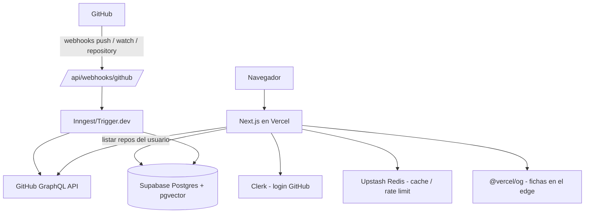

# Arquitectura técnica

<!-- Documento vivo. Actualizar cada vez que cambie el stack, la estructura de carpetas
     o cualquier decisión técnica relevante.
     Los cambios deben registrarse también en changelog/. -->

---

## Stack seleccionado

| Capa | Tecnología | Justificación |
|------|-----------|---------------|
| Framework + hosting | Next.js (App Router) + Vercel | Streaming del feed con Server Components; despliegue zero-config |
| Base de datos | Supabase Postgres + pgvector | Relacional estándar (users, repos, follows) + embeddings de README/topics para similitud futura |
| Autenticación | Clerk (provider de GitHub) | Evita montar OAuth a mano; sesión gestionada |
| Sincronización GitHub | GitHub App + webhooks | Tiempo real sin polling; límites de rate más generosos que una OAuth App (5000 req/h se agota a escala) |
| Jobs en background | Inngest o Trigger.dev (elegir al implementar) | Import inicial y generación de fichas sin bloquear requests |
| Generación de fichas | `@vercel/og` (Satori) | JSX → imagen en el edge, cacheable por CDN; sin Playwright ni canvas manual |
| Cache / rate limiting propio | Upstash Redis | Serverless, encaja con Vercel |
| Estilos | Tailwind CSS | Velocidad; coherente con el resto del stack Vercel |

---

## Diagrama de componentes



---

## Estructura de carpetas

Estado actual (✅ existe · ⏳ pendiente, se crea con su feature):

```
src/
├── app/
│   ├── page.tsx          → ✅ Feed de scroll infinito (M-06)
│   ├── dev/cards/        → ✅ Demo local de fichas sobre fixtures
│   ├── dev/seed/         → ✅ Demo local de los repos semilla importados (lee de la DB)
│   ├── dev/notes/        → ✅ Demo local de la nota y el compositor (fixtures; lo testeable sin Clerk)
│   ├── u/[username]/     → ✅ Perfil público (M-05): identidad + grid de fichas, og:image propia
│   ├── onboarding/       → ✅ Selección de repos tras el login (M-02)
│   ├── settings/repos/   → ✅ Gestión de la selección + server action de importación (M-03)
│   ├── settings/account/ → ✅ Baja de cuenta (M-11): borrado real DB→Clerk con cascada
│   └── api/
│       ├── og/               → ✅ Generación de fichas con @vercel/og (og:image/embeds)
│       ├── feed/             → ✅ Paginación del feed por cursor keyset (lista mixta: repos + notas, C-11)
│       ├── notes/            → ✅ Server actions de publicar y borrar notas (C-09)
│       ├── webhooks/github/  → ✅ Webhooks de GitHub (M-08): firma HMAC + sync desde payload
│       └── signals/          → ✅ Registro de señales implícitas (M-09; solo escritura)
├── components/
│   ├── account/          → ✅ DeleteAccount (zona de peligro, confirmación en dos pasos)
│   ├── auth/             → ✅ AuthControls (entrar con GitHub / menú de usuario / Mis repos)
│   ├── follow/           → ✅ FollowButton (toggle optimista; emite follow_author desde tarjetas)
│   ├── selection/        → ✅ SelectionPage + RepoSelector (onboarding y settings comparten)
│   ├── feed/             → ✅ RepoCard (HTML/CSS), FeedList (IntersectionObserver, lista mixta); ui/ ⏳
│   └── notes/            → ✅ NoteCard y NoteComposer (C-09)
├── proxy.ts              → ✅ clerkMiddleware (sesión en todas las rutas; ninguna exige login aún)
├── lib/
│   ├── card-seed/        → ✅ Semilla determinista, colores Linguist vendorizados, paleta
│   ├── github/           → ✅ Cliente GraphQL, token OAuth vía Clerk, listado/importación, verificación y handlers de webhooks
│   ├── db/               → ✅ Cliente Supabase (service role), queries de repos, profiles, selección, señales, reportes y notas
│   ├── moderation/       → ✅ Filtro básico de contenido (S-01): lista corta + límites de palabra
│   └── signals/          → ✅ Tipos/validación de señales y tracker de cliente (dwell, expand, click)
├── jobs/
│   └── seed-trending/    → ✅ Import manual de trending (pnpm seed:trending); Inngest/Trigger.dev ⏳
└── types/                → ⏳
e2e/                      → ✅ Tests Playwright (contra localhost)
scripts/                  → ✅ verificar-cobertura.mjs, regen-linguist-colors.mjs
supabase/                 → ✅ config.toml (stack local en puertos 573xx) y migrations/
```

Desarrollo local de base de datos: `supabase start` (Docker). Los puertos van en el rango
573xx para convivir con otros proyectos Supabase locales de la máquina. Los tests y el seed
apuntan por defecto al stack local; el proyecto remoto requiere acción explícita (`--remote`,
o aplicar migraciones con `DATABASE_URL`, que lanza Pol).

---

## Estrategia de autenticación

- **Clerk con provider de GitHub** para el login de usuarios y la sesión.
- **El listado e importación de repos (M-02/M-03) usan el token OAuth del propio usuario**,
  obtenido del backend de Clerk (`getUserOauthAccessToken`), para el GraphQL de GitHub
  (`languages` por bytes, `repositoryTopics`). Escala por usuario (5.000 req/h cada uno) y no
  requiere instalación de ninguna App.
- **GitHub App propia** (no OAuth App simple) para lo que el token de usuario no cubre:
  suscripción a webhooks **solo de los repos seleccionados** y sincronización continua (M-08).
- Rutas públicas: feed y perfiles. Rutas protegidas: onboarding, settings, acciones de follow
  e importación.

---

## Integraciones externas

- **GitHub:** fuente de todos los datos de repos. Webhooks activos en
  `/api/webhooks/github` (M-08): `push` (refresco de datos), `star`/`watch` (stars),
  `repository` (deleted/privatized → retirar contenido; publicized → reactivar; renamed →
  refrescar), `installation` (created/deleted → registrar/limpiar la instalación en el
  perfil, C-08) e `installation_repositories` (cambios de repos cubiertos → registrar; es el
  único evento que llega al actualizar una instalación existente). Firma HMAC SHA-256 obligatoria (`GITHUB_WEBHOOK_SECRET`); el endpoint solo
  actualiza, nunca inserta. La sincronización usa los datos del propio payload — sin llamadas
  a la API ni tokens.
- **Clerk:** autenticación y gestión de sesión.
- **Supabase:** Postgres + pgvector. Ver `data-model.md`.
- **Inngest o Trigger.dev:** import inicial, generación de fichas, import de trending.
- **Upstash Redis:** cache de respuestas de GitHub y rate limiting propio.
- **@vercel/og:** render de la ficha (fondo + nombre + descripción) en el edge.

---

## MCPs del proyecto

| Servidor | Alcance | Para qué se usa | Variables necesarias |
|----------|---------|-----------------|----------------------|
| supabase | project | Consultar esquema, aplicar migraciones y revisar logs de la base de datos | — (OAuth vía `/mcp`) |
| vercel | project | Revisar deploys, logs de build/runtime y analítica del proyecto | — (OAuth vía `/mcp`) |

Ambos son los servidores remotos HTTP oficiales (`https://mcp.supabase.com/mcp` y
`https://mcp.vercel.com`), declarados en `.mcp.json`. La primera vez que se abre el repo, Claude
Code pide aprobar los servidores de proyecto y autenticarse con `/mcp`.

---

## Estrategia de despliegue

- **Vercel**, con producción en `main`. Dominio: `snapstack.sh`.
- **Despliegue manual, nunca automático**: `vercel.json` fija `git.deploymentEnabled: false`,
  de modo que ningún push ni merge publica por su cuenta. Se lanza a mano
  (`pnpm dlx vercel --prod`, el panel o un deploy hook). Decisión de Pol: quiere elegir el
  momento de cada publicación.
- Entornos: local (`pnpm dev`) → producción (despliegue manual).
- Variables de entorno por entorno en Vercel; en local, `.env.local` (ver `.env.example`).
- **Quién despliega:** Pol, a mano. El agente prepara y explica, no publica (ver "Límites de
  ejecución" en CLAUDE.md).
- **El procedimiento completo de la primera salida a producción está en `docs/deploy.md`**
  (Supabase remoto, Clerk de producción, GitHub App, Vercel, siembra y comprobaciones).

### GitHub App (pendiente: se crea el día del primer deploy)

El endpoint de webhooks ya existe y es agnóstico de quién entrega; la GitHub App es la pieza
de entrega en producción. Checklist para cuando haya URL pública:

1. Crear la App en GitHub (Settings → Developer settings → GitHub Apps): nombre "Snapstack",
   webhook URL `https://snapstack.sh/api/webhooks/github`, secret nuevo (→
   `GITHUB_WEBHOOK_SECRET` en Vercel, distinto del de dev).
2. Permisos: Contents read-only (lo exige el evento push), Metadata read-only. Sin permisos
   de escritura.
3. Eventos suscritos: `push`, `star`, `repository`.
4. Instalación por usuario en **solo sus repos seleccionados** (el instalador nativo de
   GitHub); enlazar `https://github.com/apps/<slug>/installations/new` desde la pantalla de
   selección tras guardar.
5. La private key de la App no se usa en v1 (la sync va por payload): guardarla solo si se
   añaden llamadas API como instalación (p. ej., refresco de `languages` por bytes).

---

## Decisiones técnicas relevantes

### 2026-08-29 — GitHub App en lugar de OAuth App simple
**Contexto:** sincronizar datos de repos a escala.
**Opciones consideradas:** OAuth App con polling; GitHub App con webhooks.
**Decisión:** GitHub App. El rate limit de OAuth App (5000 req/h) se agota rápido a escala;
los webhooks evitan polling.
**Consecuencias:** hay que registrar la App, gestionar su instalación y verificar firmas de
webhook.

### 2026-08-29 — Selección manual de repos, sin importación masiva
**Contexto:** muchos repos públicos de un dev no aportan al feed (ejercicios, forks, pruebas)
y bajan la calidad percibida del perfil.
**Decisión:** tras el login, el usuario elige manualmente qué repos importar, con límite
(v1: 5, configurable). La sincronización solo cubre los seleccionados.
**Consecuencias:** curación forzada, coste de sync acotado; hace falta UI de gestión de la
selección post-onboarding.

### 2026-08-29 — Fichas procedurales con @vercel/og, sin screenshots de demos
**Contexto:** cómo generar la imagen de cada ficha.
**Opciones consideradas:** captura de la URL de demo con navegador headless; render procedural.
**Decisión:** fondo procedural determinista (hash del ID/nombre del repo como semilla, paleta
anclada al color Linguist del lenguaje dominante) renderizado con `@vercel/og`.
**Consecuencias:** sin cola de jobs de captura, sin riesgo de SSRF, sin coste de headless, y
cubre el 100 % de los repos. Si algún día se retoman las capturas, la URL de demo es un campo
público editable por terceros: habrá que validar contra IPs privadas/loopback.

### 2026-08-29 — Import de M-02 con el token OAuth del usuario; GitHub App pospuesta a M-08
**Contexto:** M-02 necesita listar los repos públicos del usuario e importar ≤5 con datos de
GraphQL.
**Opciones consideradas:** montar ya la GitHub App (instalación por usuario) o usar el token
OAuth que Clerk ya gestiona.
**Decisión:** token del usuario vía Clerk. El argumento del rate limit contra OAuth aplica a
sincronización continua, no a un import puntual: el token de cada usuario da 5.000 req/h
propios. La App queda para M-08, donde los webhooks la hacen imprescindible.
**Consecuencias:** cero configuración extra ahora; en M-08 habrá que crear la App y decidir su
flujo de instalación. Verificado que la instancia dev de Clerk expone el token (scopes
`read:user`, `user:email`, suficientes para datos públicos).

### 2026-08-29 — La propiedad de un repo se verifica en servidor, no se confía al cliente
**Contexto:** `/security-review` antes del despliegue encontró que `saveSelectionAction`
aceptaba cualquier lista de `full_name` del cliente. La consulta de detalle
(`repository(owner, name)`) resuelve cualquier repo público, y el upsert por
`github_repo_id` sobreescribía la fila entera — dueño incluido.
**Decisión:** doble comprobación. (1) En la acción: el `owner.login` que devuelve GitHub debe
coincidir con el username del perfil que importa. (2) En la capa de datos: `importOwnedRepos`
rechaza cualquier fila que ya pertenezca a otro perfil, y el UPDATE lleva el dueño permitido
en su propio filtro, de modo que la condición la aplica Postgres.
**Consecuencias:** las semillas sin dueño se siguen reclamando (comportamiento buscado), pero
un repo de otro usuario no se puede reasignar. La misma regla se aplicó al seed de trending:
un repo ya curado por alguien no vuelve a semilla aunque siga en trending.

### 2026-08-29 — Sin algoritmo de recomendación en v1
**Contexto:** no hay señal explícita (no hay swipe/like) ni volumen de datos.
**Decisión:** feed en orden aleatorio estable por visita (keyset sobre `card_seed` con punto
de entrada aleatorio y vuelta completa; ficha `feed-orden-aleatorio.md`) con filtro por
follows. Las señales implícitas (permanencia,
expandir, click, follow) **se instrumentan desde el día uno** pero no alimentan ningún ranking.
**Consecuencias:** cuando haya volumen, habrá histórico de señales para decidir con datos. La
similitud entre repos, si entra, irá por embeddings (pgvector), no por interacciones.
