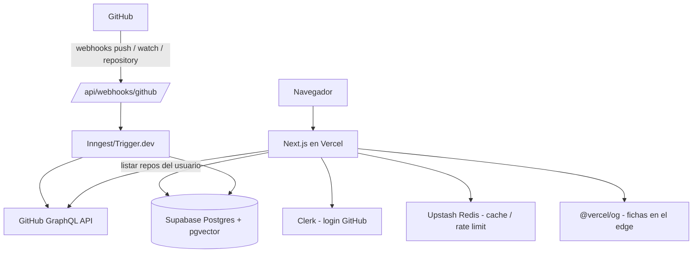

# Arquitectura técnica

<!-- Documento vivo. Actualizar cada vez que cambie el stack, la estructura de carpetas
     o cualquier decisión técnica relevante.
     Los cambios deben registrarse también en changelog/. -->

---

## Stack seleccionado

| Capa | Tecnología | Justificación |
|------|-----------|---------------|
| Framework + hosting | Next.js (App Router) + Vercel | Streaming del feed con Server Components; despliegue zero-config |
| Base de datos | Supabase Postgres + pgvector | Relacional estándar (users, repos, follows) + embeddings de README/topics para similitud futura |
| Autenticación | Clerk (provider de GitHub) | Evita montar OAuth a mano; sesión gestionada |
| Sincronización GitHub | GitHub App + webhooks | Tiempo real sin polling; límites de rate más generosos que una OAuth App (5000 req/h se agota a escala) |
| Jobs en background | Inngest o Trigger.dev (elegir al implementar) | Import inicial y generación de fichas sin bloquear requests |
| Generación de fichas | `@vercel/og` (Satori) | JSX → imagen en el edge, cacheable por CDN; sin Playwright ni canvas manual |
| Cache / rate limiting propio | Upstash Redis | Serverless, encaja con Vercel |
| Estilos | Tailwind CSS | Velocidad; coherente con el resto del stack Vercel |

---

## Diagrama de componentes



---

## Estructura de carpetas

Estado actual (✅ existe · ⏳ pendiente, se crea con su feature):

```
src/
├── app/
│   ├── page.tsx          → ✅ Feed de scroll infinito (M-06)
│   ├── dev/cards/        → ✅ Demo local de fichas sobre fixtures
│   ├── dev/seed/         → ✅ Demo local de los repos semilla importados (lee de la DB)
│   ├── u/[username]/     → ⏳ Perfil público
│   ├── onboarding/       → ⏳ Selección de repos tras el login
│   ├── settings/         → ⏳ Gestión de selección, baja de cuenta
│   └── api/
│       ├── og/               → ✅ Generación de fichas con @vercel/og (og:image/embeds)
│       ├── feed/             → ✅ Paginación del feed por cursor keyset
│       ├── webhooks/github/  → ⏳ Recepción de webhooks de la GitHub App
│       └── signals/          → ⏳ Registro de señales implícitas
├── components/
│   └── feed/             → ✅ RepoCard (HTML/CSS), FeedList (IntersectionObserver); ui/ ⏳
├── lib/
│   ├── card-seed/        → ✅ Semilla determinista, colores Linguist vendorizados, paleta
│   ├── github/           → ⏳ Cliente GraphQL, GitHub App, verificación de webhooks
│   ├── db/               → ✅ Cliente Supabase (service role) y queries de repos
│   └── signals/          → ⏳ Instrumentación de señales implícitas
├── jobs/
│   └── seed-trending/    → ✅ Import manual de trending (pnpm seed:trending); Inngest/Trigger.dev ⏳
└── types/                → ⏳
e2e/                      → ✅ Tests Playwright (contra localhost)
scripts/                  → ✅ verificar-cobertura.mjs, regen-linguist-colors.mjs
supabase/                 → ✅ config.toml (stack local en puertos 573xx) y migrations/
```

Desarrollo local de base de datos: `supabase start` (Docker). Los puertos van en el rango
573xx para convivir con otros proyectos Supabase locales de la máquina. Los tests y el seed
apuntan por defecto al stack local; el proyecto remoto requiere acción explícita (`--remote`,
o aplicar migraciones con `DATABASE_URL`, que lanza Pol).

---

## Estrategia de autenticación

- **Clerk con provider de GitHub** para el login de usuarios y la sesión.
- **GitHub App propia** (no OAuth App simple) para la integración con repos: listado de repos
  públicos del usuario, datos por GraphQL (`languages` por bytes, `repositoryTopics`) y
  suscripción a webhooks **solo de los repos seleccionados**.
- Rutas públicas: feed y perfiles. Rutas protegidas: onboarding, settings, acciones de follow
  e importación.

---

## Integraciones externas

- **GitHub (GitHub App):** fuente de todos los datos de repos. Webhooks: `push`,
  `watch` (stars), `repository` (borrado y cambio de visibilidad → retirar contenido).
- **Clerk:** autenticación y gestión de sesión.
- **Supabase:** Postgres + pgvector. Ver `data-model.md`.
- **Inngest o Trigger.dev:** import inicial, generación de fichas, import de trending.
- **Upstash Redis:** cache de respuestas de GitHub y rate limiting propio.
- **@vercel/og:** render de la ficha (fondo + nombre + descripción) en el edge.

---

## MCPs del proyecto

| Servidor | Alcance | Para qué se usa | Variables necesarias |
|----------|---------|-----------------|----------------------|
| supabase | project | Consultar esquema, aplicar migraciones y revisar logs de la base de datos | — (OAuth vía `/mcp`) |
| vercel | project | Revisar deploys, logs de build/runtime y analítica del proyecto | — (OAuth vía `/mcp`) |

Ambos son los servidores remotos HTTP oficiales (`https://mcp.supabase.com/mcp` y
`https://mcp.vercel.com`), declarados en `.mcp.json`. La primera vez que se abre el repo, Claude
Code pide aprobar los servidores de proyecto y autenticarse con `/mcp`.

---

## Estrategia de despliegue

- **Vercel**, con previews por rama y producción en `main`. Dominio: `snapstack.sh`.
- Entornos: local (`pnpm dev`) → preview (PR) → producción (merge a `main`).
- Variables de entorno por entorno en Vercel; en local, `.env.local` (ver `.env.example`).
- **Quién despliega:** Pol, desde Vercel (merge a `main` publica). El agente prepara y explica,
  no publica (ver "Límites de ejecución" en CLAUDE.md).

---

## Decisiones técnicas relevantes

### 2026-08-29 — GitHub App en lugar de OAuth App simple
**Contexto:** sincronizar datos de repos a escala.
**Opciones consideradas:** OAuth App con polling; GitHub App con webhooks.
**Decisión:** GitHub App. El rate limit de OAuth App (5000 req/h) se agota rápido a escala;
los webhooks evitan polling.
**Consecuencias:** hay que registrar la App, gestionar su instalación y verificar firmas de
webhook.

### 2026-08-29 — Selección manual de repos, sin importación masiva
**Contexto:** muchos repos públicos de un dev no aportan al feed (ejercicios, forks, pruebas)
y bajan la calidad percibida del perfil.
**Decisión:** tras el login, el usuario elige manualmente qué repos importar, con límite
(v1: 5, configurable). La sincronización solo cubre los seleccionados.
**Consecuencias:** curación forzada, coste de sync acotado; hace falta UI de gestión de la
selección post-onboarding.

### 2026-08-29 — Fichas procedurales con @vercel/og, sin screenshots de demos
**Contexto:** cómo generar la imagen de cada ficha.
**Opciones consideradas:** captura de la URL de demo con navegador headless; render procedural.
**Decisión:** fondo procedural determinista (hash del ID/nombre del repo como semilla, paleta
anclada al color Linguist del lenguaje dominante) renderizado con `@vercel/og`.
**Consecuencias:** sin cola de jobs de captura, sin riesgo de SSRF, sin coste de headless, y
cubre el 100 % de los repos. Si algún día se retoman las capturas, la URL de demo es un campo
público editable por terceros: habrá que validar contra IPs privadas/loopback.

### 2026-08-29 — Sin algoritmo de recomendación en v1
**Contexto:** no hay señal explícita (no hay swipe/like) ni volumen de datos.
**Decisión:** feed cronológico con filtro por follows. Las señales implícitas (permanencia,
expandir, click, follow) **se instrumentan desde el día uno** pero no alimentan ningún ranking.
**Consecuencias:** cuando haya volumen, habrá histórico de señales para decidir con datos. La
similitud entre repos, si entra, irá por embeddings (pgvector), no por interacciones.
