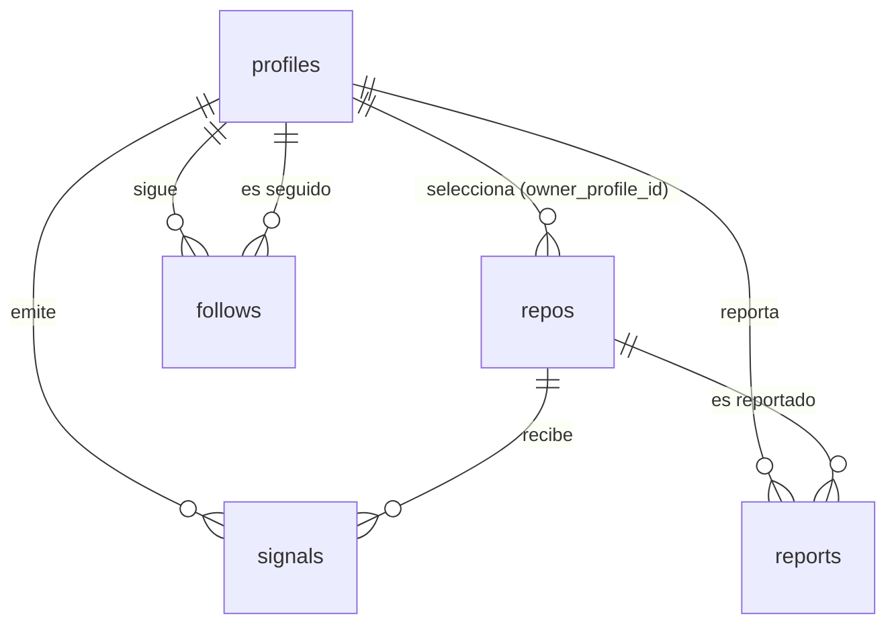

# Modelo de datos

<!-- Actualizar este archivo cada vez que se añada, modifique o elimine una tabla o relación.
     El agente de codificación debe consultar este archivo antes de hacer cualquier migración. -->

---

## Entidades principales

### profiles
Usuario de Snapstack, vinculado a su identidad de Clerk/GitHub.
| Campo | Tipo | Descripción |
|-------|------|-------------|
| id | uuid (PK) | Identificador interno |
| clerk_id | text (único) | ID del usuario en Clerk |
| github_id | bigint (único) | ID numérico del usuario en GitHub |
| username | text (único) | Login de GitHub, usado en la URL del perfil |
| display_name | text | Nombre visible |
| avatar_url | text | Avatar de GitHub |
| onboarded_at | timestamptz (nullable) | Cuándo completó o saltó el onboarding; NULL = la home le redirige allí |
| tagline | text (nullable, ≤ 80) | Una línea bajo el nombre en el perfil (C-03, migración 009) |
| bio | text (nullable, ≤ 280) | Bio breve bajo la cabecera del perfil (C-03, migración 009) |
| social_links | jsonb (default `{}`) | `{plataforma: url}` con lista blanca validada en servidor (C-03, migración 009) |
| github_installation_id | bigint (nullable) | Instalación de la GitHub App (C-08, migración 015); NULL = aviso de instalación visible |
| created_at | timestamptz | Alta |

### repos
Repositorio importado al feed. `owner_profile_id` es NULL en los repos semilla (trending
importados sin login del autor); si el autor se registra después, el repo puede reclamarse.
| Campo | Tipo | Descripción |
|-------|------|-------------|
| id | uuid (PK) | Identificador interno |
| github_repo_id | bigint (único) | ID del repo en GitHub (estable ante renombrados) |
| owner_profile_id | uuid (FK → profiles, nullable) | Quién lo tiene en su selección; NULL = semilla |
| owner_login | text (nullable) | Login del dueño en GitHub (denormalizado, para la tarjeta) |
| owner_avatar_url | text (nullable) | Avatar del dueño (denormalizado, para la tarjeta) |
| full_name | text | `owner/nombre` en GitHub |
| description | text | Descripción corta |
| url | text | URL del repo en GitHub |
| primary_language | text | Lenguaje dominante (por bytes) |
| languages | jsonb | Desglose de lenguajes por bytes (GraphQL `languages`) |
| topics | text[] | `repositoryTopics` declarados por el autor |
| stars | integer | Contador de stars, actualizado por webhook `watch` |
| click_count | integer | Clicks hacia el repo. Desnormalizado de `signals` (migración 007): el feed lo pinta en cada tarjeta y agregar la tabla de señales en cada carga no escala |
| readme_md | text (nullable, ≤ 200k) | README cacheado para el detalle (C-05, migración 011); NULL = sin README, filtrado o aún no traído |
| readme_fetched_at | timestamptz (nullable) | Cuándo se intentó traer; NULL = pendiente de backfill |
| card_seed | text | Semilla determinista del fondo (hash de github_repo_id) |
| status | text | `active` / `removed` (borrado o privado en GitHub, ver webhook `repository`) |
| is_seed | boolean | true si entró por el import de trending |
| imported_at | timestamptz | Cuándo entró a la selección |
| last_synced_at | timestamptz | Última sincronización con GitHub |

El límite de repos activos por perfil (v1: 5) vive en configuración, no en el esquema, para
poder ajustarlo sin migración. Se valida en la capa de aplicación al importar.

### follows
| Campo | Tipo | Descripción |
|-------|------|-------------|
| follower_id | uuid (FK → profiles) | Quién sigue |
| followed_id | uuid (FK → profiles) | A quién |
| created_at | timestamptz | Cuándo |

PK compuesta (`follower_id`, `followed_id`). Un usuario no puede seguirse a sí mismo (check).

### notifications
Notificaciones in-app (C-04, migración 010). Genérica (`type` + `payload`) aunque v1 solo
emite `new_follower`; el dedupe de ese tipo es de aplicación (una por par destinatario/actor,
para siempre). Cascada con `profiles` en ambos extremos: la baja de cuenta no deja huérfanas.
| Campo | Tipo | Descripción |
|-------|------|-------------|
| id | uuid (PK) | Identificador |
| recipient_profile_id | uuid (FK → profiles) | Quién la recibe |
| actor_profile_id | uuid (FK → profiles, nullable) | Quién la provoca |
| type | text (check) | `new_follower` \| `repo_update` (migración 013) |
| payload | jsonb (default `{}`) | Datos extra del tipo; vacío en `new_follower` |
| created_at | timestamptz | Cuándo ocurrió |
| read_at | timestamptz (nullable) | NULL = no leída (índice parcial para el badge) |

### github_app_tokens
Tokens user-to-server de la GitHub App (C-07, migración 014), cifrados en aplicación
(AES-256-GCM, clave en el entorno). RLS sin políticas; cascada con profiles.
| Campo | Tipo | Descripción |
|-------|------|-------------|
| profile_id | uuid (PK, FK → profiles) | Dueño del token |
| access_token_enc | text | Access token cifrado |
| refresh_token_enc | text (nullable) | Refresh token cifrado, si la App emite expiración |
| access_expires_at | timestamptz (nullable) | NULL = no expira |
| updated_at | timestamptz | Último guardado/refresh |

### repo_subscriptions
Suscripciones a los pushes de un repo (C-06, migración 013). Opt-in por repo; RLS sin
políticas (solo service role). Cascada con profiles y repos.
| Campo | Tipo | Descripción |
|-------|------|-------------|
| subscriber_profile_id | uuid (PK, FK → profiles) | Quién se suscribe |
| repo_id | uuid (PK, FK → repos) | A qué repo |
| created_at | timestamptz | Alta |

### signals
Señales implícitas del feed. Solo instrumentación en v1: ningún ranking las consume.
| Campo | Tipo | Descripción |
|-------|------|-------------|
| id | uuid (PK) | — |
| profile_id | uuid (FK → profiles, nullable) | NULL si el visitante no tiene sesión |
| repo_id | uuid (FK → repos) | Ficha sobre la que ocurre |
| type | text | `dwell` / `expand` / `click_repo` / `follow_author` |
| value | integer (nullable) | ms de permanencia en `dwell`; NULL en el resto |
| created_at | timestamptz | — |

### reports
Reportes de moderación ligera (S-01).
| Campo | Tipo | Descripción |
|-------|------|-------------|
| id | uuid (PK) | — |
| reporter_id | uuid (FK → profiles) | Quién reporta |
| repo_id | uuid (FK → repos) | Ficha reportada |
| reason | text | Motivo libre |
| status | text | `open` / `resolved` / `dismissed` |
| created_at | timestamptz | — |

### repo_embeddings (futura, C-01)
Embeddings de README/topics por repo (pgvector) para similitud de stack. No se crea en v1;
queda documentada para que el diseño del resto del esquema no la impida.

---

## Relaciones entre entidades

---

## Políticas de acceso (RLS)

El acceso a datos pasa por el servidor Next.js (service role); RLS actúa como segunda línea.

### profiles
- SELECT: público (los perfiles son públicos).
- UPDATE / DELETE: solo el propio usuario. El borrado de cuenta (M-11) elimina en cascada
  repos, follows, signals y reports del usuario.

### repos
- SELECT: público solo si `status = 'active'`.
- INSERT / UPDATE / DELETE: solo el dueño (o el sistema para semillas y webhooks).

### follows
- SELECT: público. INSERT / DELETE: solo como `follower_id` el propio usuario.

### github_app_tokens
Tokens user-to-server de la GitHub App (C-07, migración 014), cifrados en aplicación
(AES-256-GCM, clave en el entorno). RLS sin políticas; cascada con profiles.
| Campo | Tipo | Descripción |
|-------|------|-------------|
| profile_id | uuid (PK, FK → profiles) | Dueño del token |
| access_token_enc | text | Access token cifrado |
| refresh_token_enc | text (nullable) | Refresh token cifrado, si la App emite expiración |
| access_expires_at | timestamptz (nullable) | NULL = no expira |
| updated_at | timestamptz | Último guardado/refresh |

### repo_subscriptions
Suscripciones a los pushes de un repo (C-06, migración 013). Opt-in por repo; RLS sin
políticas (solo service role). Cascada con profiles y repos.
| Campo | Tipo | Descripción |
|-------|------|-------------|
| subscriber_profile_id | uuid (PK, FK → profiles) | Quién se suscribe |
| repo_id | uuid (PK, FK → repos) | A qué repo |
| created_at | timestamptz | Alta |

### signals
- INSERT: cualquier sesión (o anónimo vía servidor). SELECT: solo sistema — no se exponen.

### reports
- INSERT: usuarios autenticados. SELECT: solo sistema.

---

## Migraciones

| Fecha | Archivo | Descripción |
|-------|---------|-------------|
| 2026-08-29 | `supabase/migrations/001_repos.sql` | Tabla `repos` con índices, check de `status` y RLS (lectura pública solo de activos) |
| 2026-08-29 | `supabase/migrations/002_repos_owner.sql` | Columnas `owner_login` y `owner_avatar_url` (identidad del autor en la tarjeta) |
| 2026-08-29 | `supabase/migrations/003_profiles.sql` | Tabla `profiles` con RLS (lectura pública) y FK `repos.owner_profile_id` → profiles |
| 2026-08-29 | `supabase/migrations/004_signals.sql` | Tabla `signals` con check de tipo y cap de value; RLS sin políticas (solo service role) |
| 2026-08-29 | `supabase/migrations/005_reports.sql` | Tabla `reports` con índice único (reporter, repo); RLS sin políticas (solo service role) |
| 2026-08-29 | `supabase/migrations/006_follows.sql` | Tabla `follows` (PK compuesta, check anti auto-follow, cascada); RLS de lectura pública |
| 2026-08-29 | `supabase/migrations/007_repo_click_count.sql` | `repos.click_count` (desnormalizado desde `signals`, con relleno) y función `increment_repo_clicks` |
| 2026-08-29 | `supabase/migrations/008_profiles_onboarded.sql` | `profiles.onboarded_at` con relleno para quien ya tenía repos (redirección al onboarding) |

---

## Datos seed

Import de repos públicos trending (M-10) para que el feed no arranque vacío:
`pnpm seed:trending` (script manual, `src/jobs/seed-trending/`) consulta la Search API oficial
de GitHub (repos con más stars creados en los últimos 30 días, ajustable con `--days` y
`--limit`) y hace upsert por `github_repo_id` con `is_seed = true` y `owner_profile_id = NULL`.
Idempotente: re-ejecutarlo refresca stars y descripción sin duplicar. Por defecto solo acepta
el Supabase local; contra el remoto exige `--remote` explícito. `GITHUB_TOKEN` opcional para
subir el rate limit.
