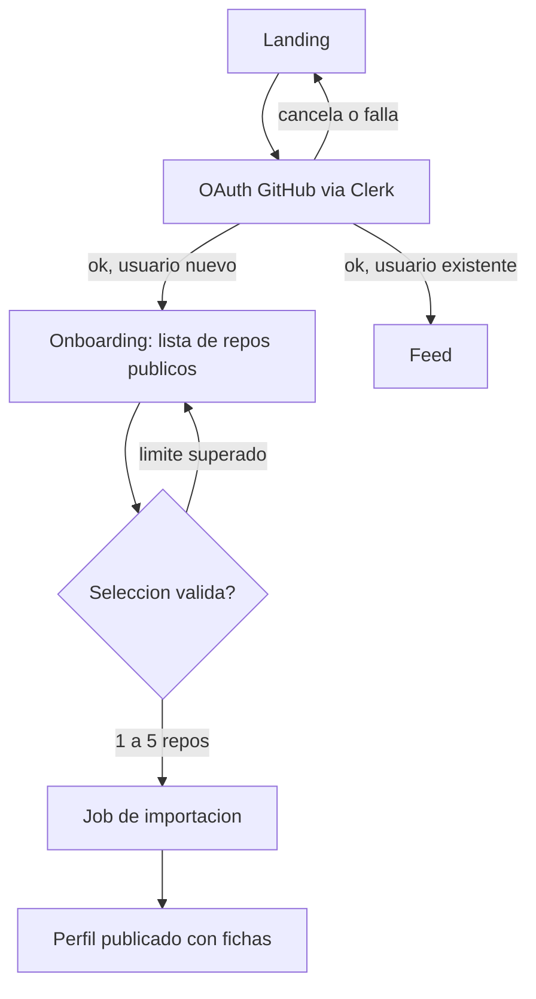
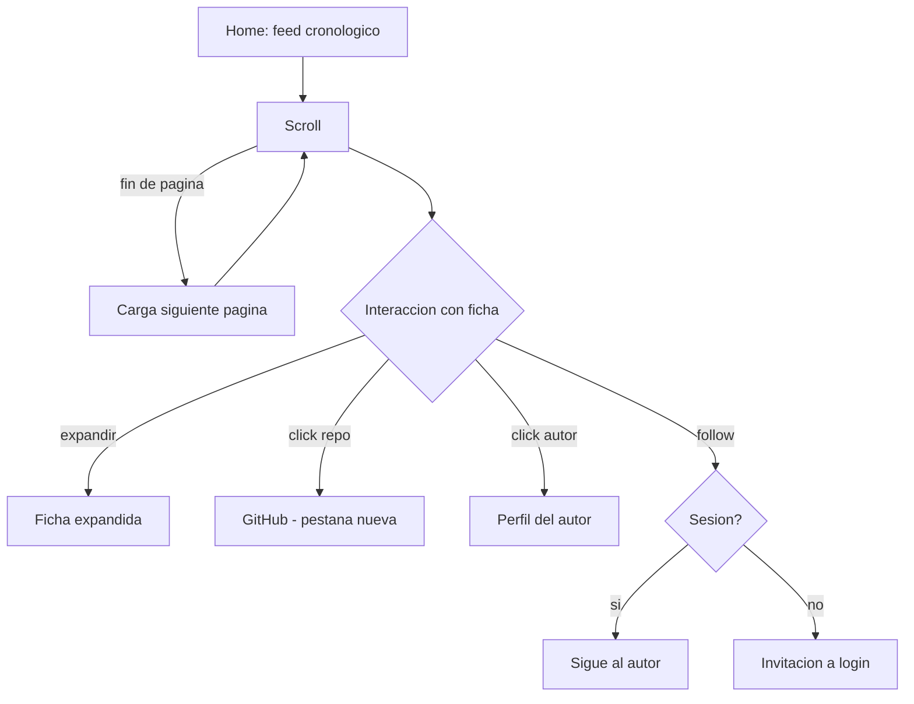
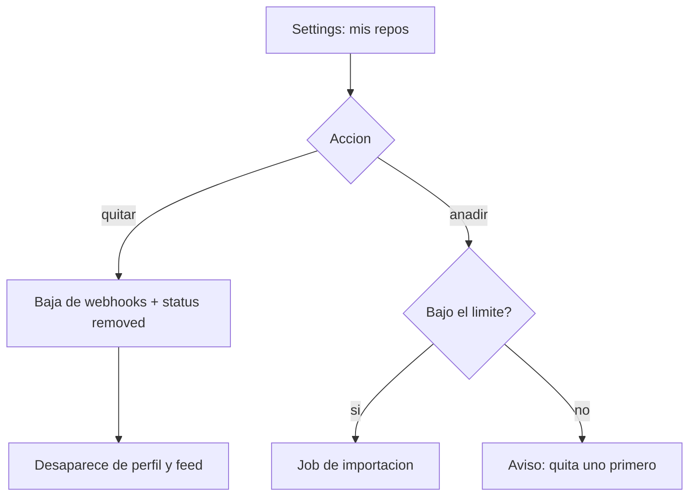
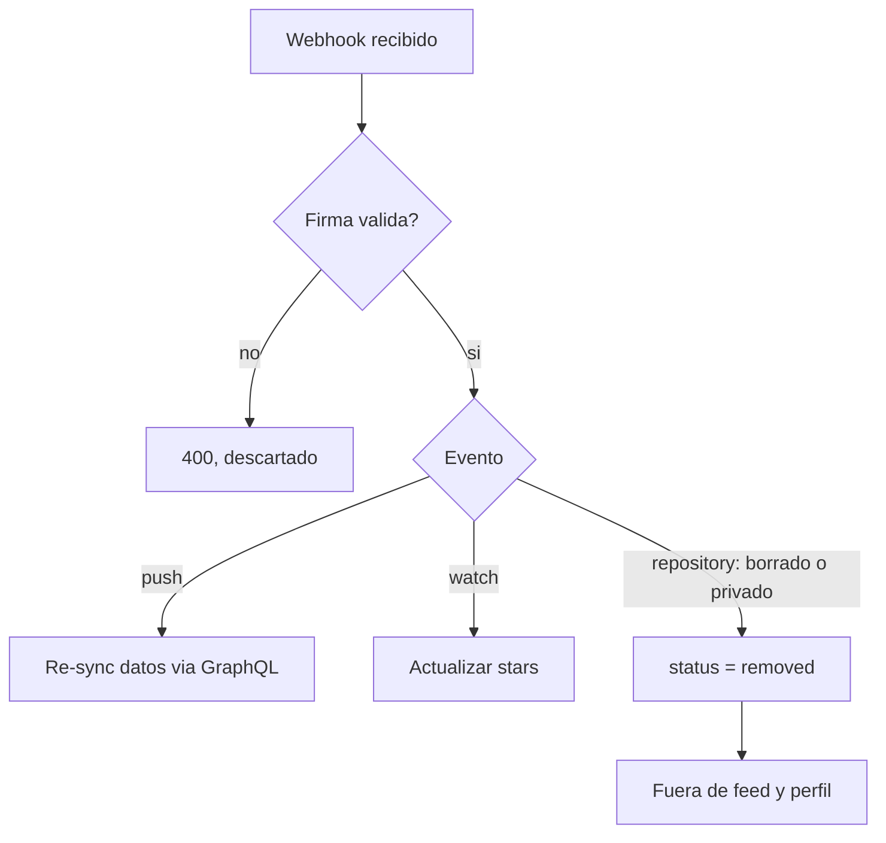
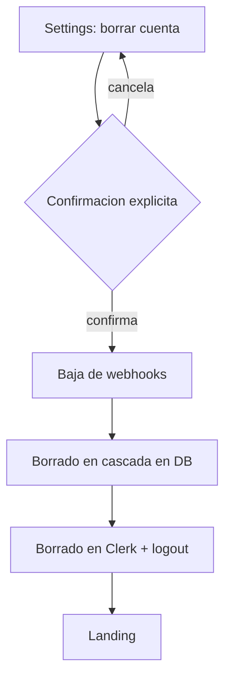

# Flujos de usuario

<!-- Documentación detallada de los flujos de usuario principales.
     El PRD los describe narrativamente; este archivo entra en detalle con diagramas y estados.
     Actualizar cuando cambie un flujo existente o se añada uno nuevo. -->

---

## Convenciones de este documento

Cada flujo lleva: descripción narrativa, diagrama Mermaid de estados, y casos de error.
Los IDs (`FLOW-xx`) se citan desde el PRD, las fichas de features y los tests.

---

## [FLOW-01] — Registro y onboarding con selección de repos

**Actor:** visitante con cuenta de GitHub
**Trigger:** pulsa "Entrar con GitHub" (M-01)
**Resultado esperado:** perfil publicado con hasta 5 repos seleccionados y sus fichas generadas

### Pasos

1. El visitante pulsa "Entrar con GitHub" y completa el OAuth vía Clerk.
2. Primera vez: se crea su `profile` y aterriza en el onboarding.
3. Ve la lista de sus repos públicos (API de GitHub) con nombre, descripción, lenguaje y stars.
4. Marca los que quiere importar; el contador muestra `n / 5`.
5. Confirma. La importación corre en background (job): datos por GraphQL, alta de webhooks del
   repo, generación de `card_seed`.
6. Aterriza en su perfil con las fichas ya visibles (o con placeholder si el job aún corre).

### Diagrama

### Casos de error

- OAuth cancelado o fallido → vuelta a la landing, sin sesión ni perfil a medias (M-01 negativo).
- Límite alcanzado → el sexto repo no se puede marcar; se indica el límite (M-02 negativo).
- API de GitHub caída al listar repos → mensaje de error con reintento; el onboarding puede
  retomarse más tarde (el perfil existe, sin repos).
- Job de importación falla en un repo → ese repo queda fuera con aviso; los demás se importan.

---

## [FLOW-02] — Navegar el feed

**Actor:** cualquier visitante (sesión opcional)
**Trigger:** abre la home
**Resultado esperado:** ha hecho scroll por fichas, opcionalmente expandido, saltado a GitHub o seguido a un autor

### Pasos

1. El feed carga la primera página de fichas en orden cronológico (M-06).
2. Al acercarse al final, se carga la siguiente página sin recarga.
3. Sobre una ficha puede: expandirla (más detalle: lenguajes, topics, stars), ir al repo en
   GitHub, ver el perfil del autor, o seguirlo (con sesión).
4. Con sesión, puede cambiar al filtro "solo seguidos" (M-07).
5. Cada interacción y la permanencia por tarjeta se registran como señal implícita (M-09),
   sin efecto visible en el orden del feed.

### Diagrama

### Casos de error

- Sin más contenido → fin de feed explícito, no spinner infinito.
- Fallo al cargar página → botón de reintento inline; lo cargado se conserva.
- Follow sin sesión → se ofrece login, no se pierde la posición de scroll.
- El registro de señales nunca bloquea la UI: si falla, falla en silencio.

---

## [FLOW-03] — Gestionar la selección de repos

**Actor:** usuario autenticado con perfil
**Trigger:** entra en settings / "mis repos"
**Resultado esperado:** su selección refleja los cambios en perfil y feed (M-03)

### Pasos

1. Ve su selección actual (`n / 5`) y la lista completa de sus repos públicos.
2. **Quitar:** el repo pasa a `status = removed`, se retiran sus webhooks, desaparece de
   perfil y feed.
3. **Añadir:** mismo camino que en el onboarding (job de importación), respetando el límite.

### Diagrama

### Casos de error

- Añadir con el límite lleno → aviso, sin cambios.
- El mismo repo no puede añadirse dos veces (único por `github_repo_id`).
- Fallo del job al añadir → el repo no aparece y se muestra el error; la selección previa
  queda intacta.

---

## [FLOW-04] — Cambios en GitHub reflejados por webhook

**Actor:** GitHub (sistema, sin usuario presente)
**Trigger:** webhook `push`, `watch` o `repository` de un repo importado (M-08)
**Resultado esperado:** los datos en Snapstack reflejan el estado real del repo

### Pasos

1. GitHub envía el webhook al endpoint; se verifica la firma.
2. `push` → re-sincronizar datos (descripción, lenguajes, topics) vía GraphQL.
3. `watch` → actualizar `stars`.
4. `repository` con borrado o paso a privado → `status = removed`: fuera del feed y del
   perfil, sin contenido fantasma.

### Diagrama

### Casos de error

- Firma inválida → descartar y registrar; nunca procesar.
- Evento de un repo desconocido → ignorar con log.
- Fallo transitorio de la API al re-sincronizar → reintento vía el sistema de jobs.

---

## [FLOW-05] — Borrado de cuenta

**Actor:** usuario autenticado
**Trigger:** "Borrar mi cuenta" en settings (M-11)
**Resultado esperado:** perfil, repos importados y datos asociados eliminados por completo

### Pasos

1. El usuario pide el borrado y confirma explícitamente (se le explica el alcance: perfil,
   repos, follows, señales).
2. Se dan de baja los webhooks de sus repos.
3. Se borran en cascada sus datos (ver `data-model.md`) y su usuario en Clerk.
4. Sesión cerrada; sus fichas ya no existen en el feed.

### Diagrama

### Casos de error

- Fallo a mitad del borrado → el proceso debe poder reanudarse (job idempotente); nunca dejar
  la cuenta en un estado mixto visible en el feed.
- Es borrado real, no desactivación: no hay flujo de "recuperar cuenta".
